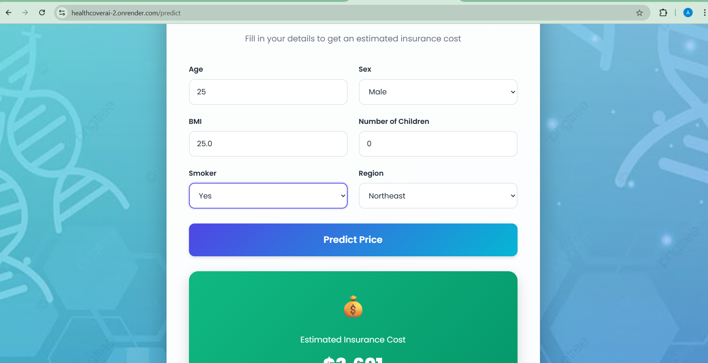

# 🏥 Health Insurance Cost Prediction (ML Web App)

An end-to-end **Machine Learning web application** that predicts **health insurance costs** based on user demographics and lifestyle details. The project integrates **data preprocessing, model comparison, hyperparameter tuning**, and **deployment using Flask** with a clean **HTML/CSS frontend**, hosted on **Render**.

---

# Problem Statement

Health insurance premiums depend on multiple factors such as age, BMI, smoking habits, and region. This project aims to build a predictive system that estimates insurance charges accurately using machine learning regression models.

# Input Features

The model takes the following inputs from the user:

* **Age**
* **Sex** (Male/Female)
* **BMI** (Body Mass Index)
* **Number of Children**
* **Smoker** (Yes/No)
* **Region** (Northeast, Northwest, Southeast, Southwest)

---

# Machine Learning Pipeline

Data Preprocessing:

* Categorical features encoded using OneHotEncoder
* Numerical features passed directly
* Implemented using ColumnTransformer

Models Evaluated:

The following regression models were trained and evaluated:
* Linear Regression
* Ridge Regression
* Lasso Regression
* Random Forest Regressor
* Gradient Boosting Regressor

Model Comparison Metrics:

* MAE (Mean Absolute Error)
* RMSE (Root Mean Squared Error)
* R² Score

# Best Model

* Random Forest Regressor (after hyperparameter tuning)
* Hyperparameter tuning: GridSearchCV (5-fold CV)
* **Test R² Score:** ~ **88%**

---

# Hyperparameter Tuning

* Used **GridSearchCV**
* Optimized parameters such as:
  * `n_estimators`
  * `max_depth`
  * `min_samples_split`
  * `min_samples_leaf`
* Scoring metric: **R²**

---

# Web Application

Frontend

* Built using HTML & CSS
* Responsive and user-friendly UI
* Input form for insurance-related details

Backend

* Flask framework
* Trained ML pipeline loaded using Pickle
* Handles user input, preprocessing, and prediction

---

# Website screenshots

Application Preview

Prediction Page

# Tech Stack

* Python
* **Pandas, NumPy
* Scikit-learn**
* Flask
* HTML, CSS
* Render (Deployment)
---

⭐ If you like this project, don’t forget to star the repository!
